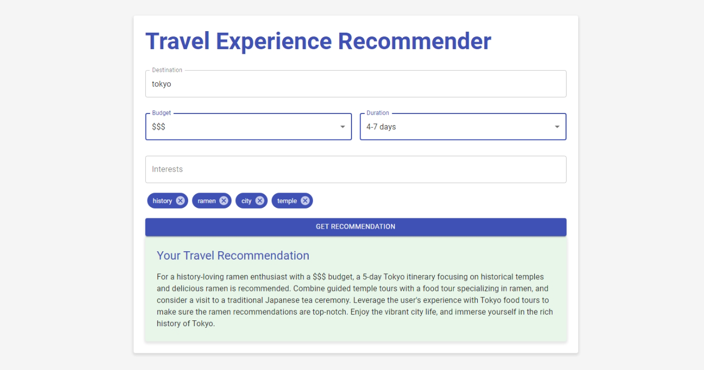

# Travel Experience Recommender

Travel Experience Recommender is a full-stack application that provides personalized travel recommendations based on user preferences. It utilizes a Retrieval-Augmented Generation (RAG) system powered by Google's Gemini API to generate tailored travel suggestions.



## Features

- RESTful API for submitting travel preferences and receiving recommendations
- React-based frontend for easy user interaction
- Retrieval-Augmented Generation (RAG) system for context-aware recommendations
- Integration with Google's Gemini API for natural language processing
- Responsive design using Material-UI

## Tech Stack

### Backend

- FastAPI
- Google Generative AI (Gemini API)
- Uvicorn
- LangChain

### Frontend

- React
- Axios
- Material-UI

## Prerequisites

- Python 3.8+
- Node.js 18+

## Installation

1. Clone the repository:
   ```
   git clone --recursive https://github.com/peter0512lee/travel-recommender.git
   cd travel-experience-recommender
   ```

2. Create and activate a virtual environment:
   ```
   python -m venv venv
   source venv/bin/activate  # On Windows use `venv\Scripts\activate`
   ```

### Backend Setup


1. Install the required packages:
   ```
   cd travel-recommender-backend
   pip install -r requirements.txt
   ```

2. Set up your environment variables in a `.env` file:
   ```
   GOOGLE_API_KEY=your_google_api_key_here
   ```
   
### Frontend Setup

1. Navigate to the frontend directory:
   ```
   cd frontend
   ```

2. Install the required packages:
   ```
   npm install --force
   ```

## Running the Application

### Start the Backend Server

1. In a new terminal, navigate to the frontend directory:
   ```
   cd travel-recommender-backend
   ```

2. run:
   ```
   python main.py
   ```
   The server will start on `http://localhost:8000`.

### Start the Frontend Development Server

1. In a new terminal, navigate to the frontend directory:
   ```
   cd travel-recommender-frontend
   ```

2. Start the React development server:
   ```
   npm start
   ```
   The frontend will be available at `http://localhost:3000`.

## API Endpoints

- `POST /recommendations`: Submit travel preferences and receive a recommendation.

  Example request body:
  ```json
  {
    "destination": "Tokyo",
    "budget": "medium",
    "duration": "5 days",
    "interests": ["food", "culture", "technology"]
  }
  ```

## Contributing

Contributions are welcome! Please feel free to submit a Pull Request.

## License

This project is licensed under the MIT License.
